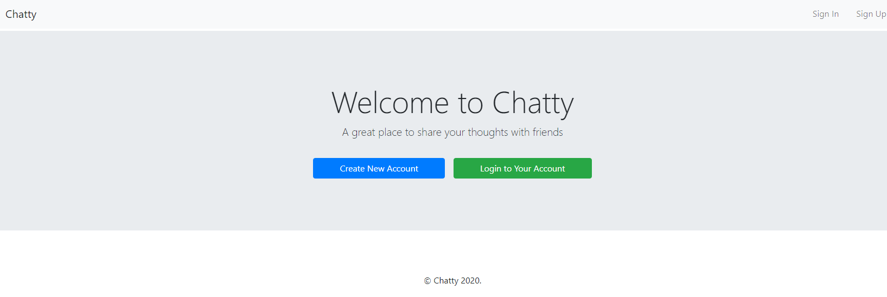
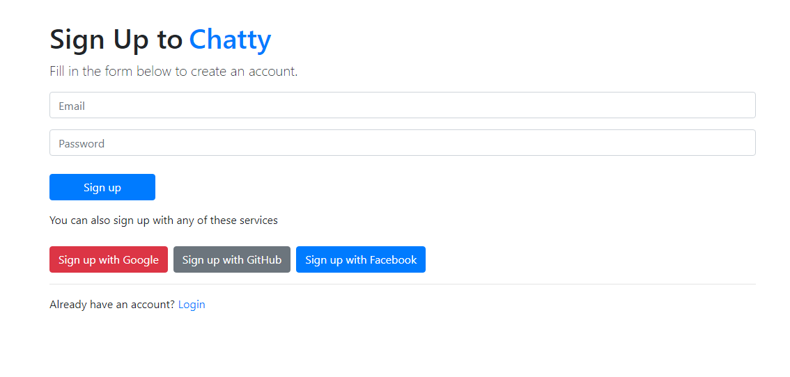
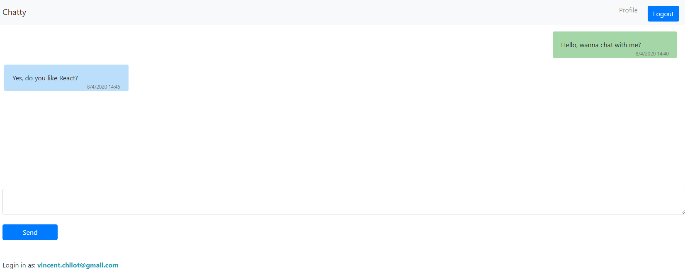
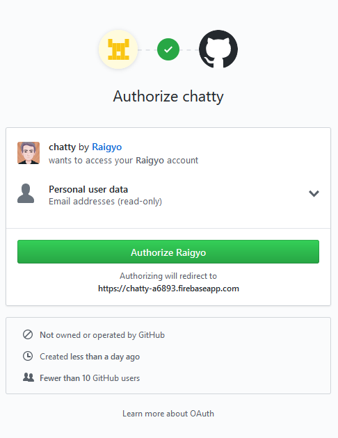
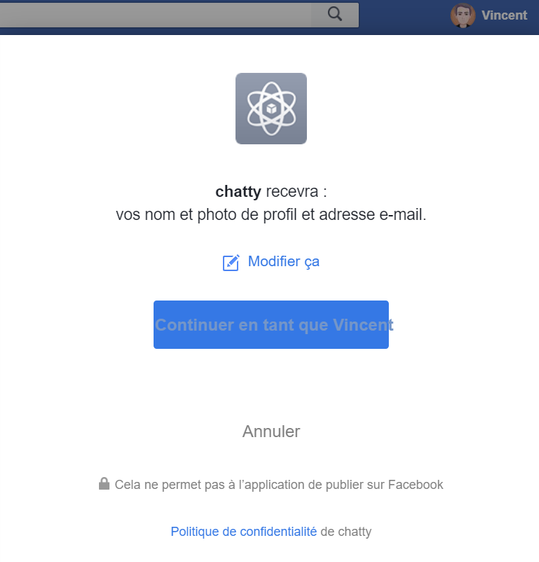
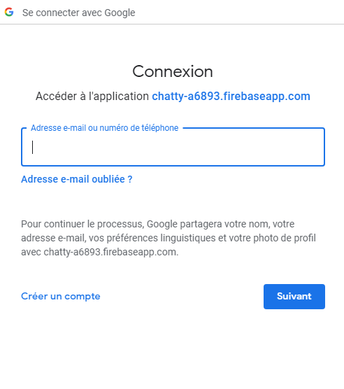
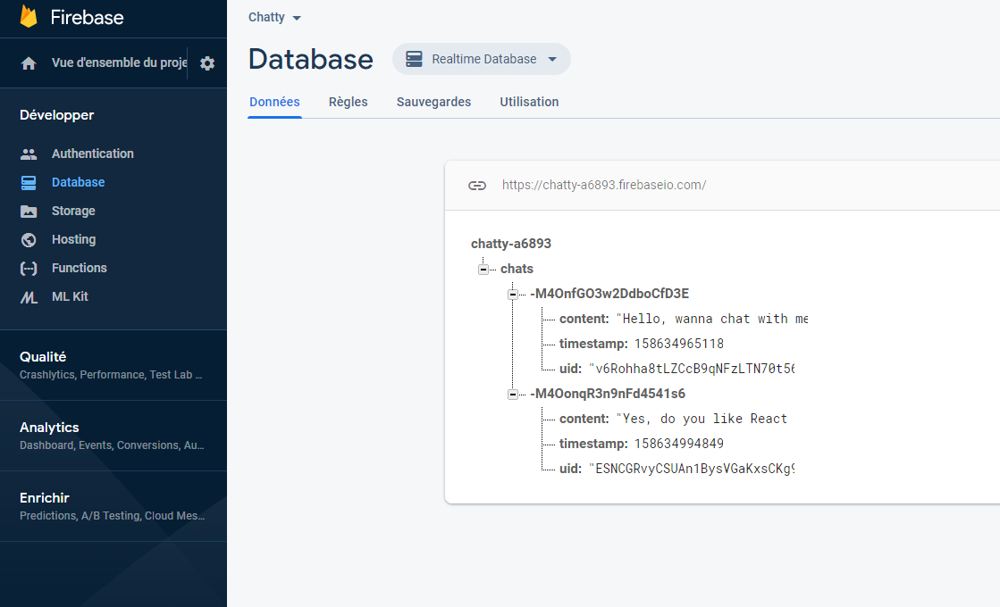

# Real-Time Chat App with React and Google Firebase - Connection with Email, Github, Facebook or Google (WIP)

*April 2020*

> 🔨 Chat made with React using Google Firebase as DB to store messages and for the connection (sign up / log in) . From CSS Tricks '[Building a Real-Time Chat App with React and Firebase](https://css-tricks.com/building-a-real-time-chat-app-with-react-and-firebase/)'. 

See the **demo** on [Github page](https://raigyo.github.io/react-chat/).

**Homepage**

**Sign Up**

**Chat**

## About

- /components: contains reusable widgets used in different pages (footer, header)
- /helpers: a set of reusable functions (auth, db)
- /pages: the app views (Home, Signup, Login, Chat)
- /services: third-party services that we’re using (Firebase)
- App.js: the root component

**Authentication**

  

## How to use

### Local

- Clone the [local-version branch](#)
- Update node_modules: `npm install`
- To run: `npm start`
- Open the app using [http://localhost:3000/](http://localhost:3000/)

### Online

See the **demo** on [Github page](https://raigyo.github.io/react-chat/)

## Usefull links

- [Building a Real-Time Chat App with React and Firebase](https://css-tricks.com/building-a-real-time-chat-app-with-react-and-firebase/)
- [Building a Real-Time Chat App with React and Firebase: Github sources](https://github.com/Dunebook/Firebase-auth-chat-app)
- [What are Higher-Order Components (HOCs) in React?](https://css-tricks.com/what-are-higher-order-components-in-react/)
- [The Circle of a React Lifecycle](https://css-tricks.com/the-circle-of-a-react-lifecycle/)
- [Github: Register a new OAuth application](https://github.com/settings/developers)
- [Facebook for developers](https://developers.facebook.com/)
- [Firebase: Allow creation of multiple accounts with the same email address ](https://stackoverflow.com/questions/37947944/authentication-using-facebook-at-first-and-then-google-causes-an-error-in-fireba)